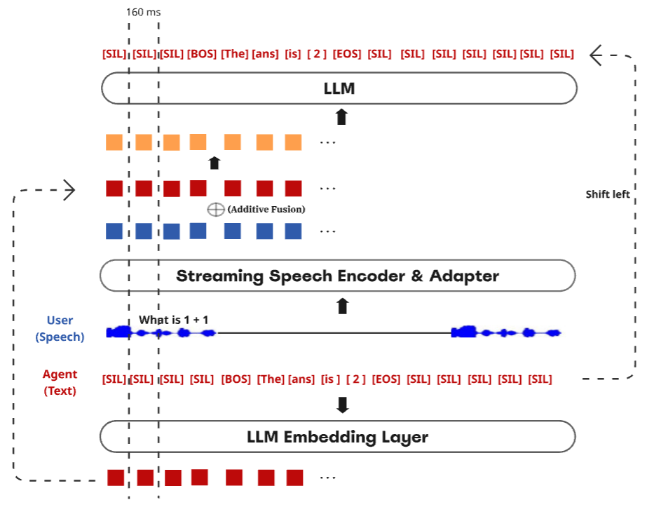

# RelayS2S — Speech-to-Speech Model

This repository contains the data and training code for the speech-to-speech model described in [RelayS2S: A Dual-Path Speculative Generation for Real-Time Dialogue](https://arxiv.org/abs/2603.23346).


## Architecture Overview



## Installation

```bash
git clone https://github.com/maiong25/relays2s.git
pip install -r requirements.txt
```

**Requirements:** Python ≥ 3.10, PyTorch ≥ 2.1, CUDA-capable GPU (tested on NVIDIA L40S 48 GB).

## Dataset & Pretrained Checkpoints

Download the speech-to-speech dataset and our model checkpoints at:

> **https://huggingface.co/datasets/mailong225/speech_to_speech**

Place the downloaded files so that your directory looks like:

```
├── data/
│   ├── train.jsonl
│   ├── valid.jsonl
│   ├── test.jsonl
│   ├── syn_dialogs/          # synthesized audio files
│   └── noises/               # TAU Urban Acoustic Scenes noise clips


checkpoints/
├── pretrained_models/
│   ├── speech_encoder.pt
│   └── adapter.pt
├── adapter/
│   └── best.ckpt
└── s2s/
    └── best.ckpt
```

## Data Format

Each line in the JSONL files contains a single conversation with the following fields:

| Field | Description |
|-------|-------------|
| `conv_id` | Unique conversation identifier |
| `conv_len` | Total conversation duration in seconds |
| `num_samples` | Total number of audio samples |
| `sampling_rate` | Audio sample rate (16kHz) |
| `user_audio` | Path to the user's audio file (.wav) |
| `user_label` | List of user utterances with start/end timestamps and text |
| `assistant_audio` | Path to the assistant's audio file (.wav) |
| `assistant_label` | List of assistant utterances with start/end timestamps and text |

Each utterance in `user_label` / `assistant_label` has:
- `start` / `end`: timestamp in seconds
- `text`: transcript
- `type`: `"standard"` (normal speech), `"backchannel"` (e.g. "oh", "got it"), or `"interrupted"` (user barge-in)

<details>
<summary>Example data entry</summary>

```json
{
  "conv_id": "3531e611927743a18cfaead4fe95ed11",
  "conv_len": 122.974,
  "num_samples": 1967583,
  "sampling_rate": 16000,
  "subset": "back_channels",
  "user_audio": "3531e611927743a18cfaead4fe95ed11_id08234_cajgMTmxOLk.wav",
  "user_label": [
    {
      "start": 0.0,
      "end": 10.596,
      "text": "Hey there! I was just thinking about the upcoming weekend and wanted to brainstorm some ideas for getting out of the city. I'm really craving some fresh air and maybe something a bit adventurous.",
      "type": "standard"
    },
    {
      "start": 27.614,
      "end": 40.246,
      "text": "Hmm, definitely more active. I was actually picturing something by the water, maybe even trying something new. I've always wanted to try water skiing, but I've never actually done it before. It seems like a lot of fun, but also a bit intimidating.",
      "type": "standard"
    },
    {
      "start": 56.336,
      "end": 68.002,
      "text": "That's good to know! I guess I just need to embrace the wipeouts then, haha. If I were to try it, what kind of gear would I need? I assume a wetsuit is a must, especially this time of year?",
      "type": "standard"
    },
    {
      "start": 85.558,
      "end": 97.652,
      "text": "Okay, wetsuit, life vest, skis, sunscreen. That makes sense. And what about after the activity? Is there anything specific I should plan for, like a change of clothes or a warm drink?",
      "type": "standard"
    },
    {
      "start": 113.646,
      "end": 118.834,
      "text": "That sounds like a perfect plan. I'm feeling much more confident about trying it now. Thanks for all the tips!",
      "type": "standard"
    }
  ],
  "assistant_audio": "3531e611927743a18cfaead4fe95ed11_id05535_pqxDKOc2ENo.wav",
  "assistant_label": [
    {
      "start": 10.796,
      "end": 27.414,
      "text": "Absolutely! I can help you brainstorm some options. What kind of adventure are you leaning towards? Are you thinking more active, like hiking or water sports, or something more relaxed, like a scenic drive or a visit to a charming town?",
      "type": "standard"
    },
    {
      "start": 35.874,
      "end": 36.674,
      "text": "oh",
      "type": "backchannel"
    },
    {
      "start": 40.446,
      "end": 56.136,
      "text": "Water skiing sounds like a fantastic idea for an active day out! It's definitely exhilarating once you get the hang of it. For a beginner, it's common to wipe out a few times initially, but most people pick it up surprisingly quickly with a good instructor and calm water conditions.",
      "type": "standard"
    },
    {
      "start": 68.202,
      "end": 85.358,
      "text": "Yes, a wetsuit is absolutely essential, especially if the water is still cool. You'll also need a life vest, which is usually provided by rental places or tour operators, and the skis themselves. Don't forget sunscreen, even on cooler days, as the sun reflects strongly off the water.",
      "type": "standard"
    },
    {
      "start": 89.536,
      "end": 90.336,
      "text": "got it",
      "type": "backchannel"
    },
    {
      "start": 97.852,
      "end": 113.446,
      "text": "Definitely bring a towel and a full change of dry, warm clothes for after you get out of the water. A warm drink, like hot chocolate or tea, would be perfect to warm you up, and maybe some snacks to refuel. Many water sports locations also have cafes or restaurants nearby.",
      "type": "standard"
    },
    {
      "start": 119.034,
      "end": 122.974,
      "text": "You're very welcome! I'm glad I could help. Have an amazing time on the water!",
      "type": "standard"
    }
  ]
}
```

</details>

## Training

Training proceeds in three stages. All stages can run on 1× NVIDIA L40S GPUs (48 GB VRAM).

### Step 0: Prepare Shar Datasets

Convert the raw JSONL + audio into [Lhotse Shar](https://github.com/lhotse-speech/lhotse) shards with precomputed filterbank features. If a noise directory is provided, background noise is mixed in during feature extraction.

```bash
# Training set
python -m data.prepare_shar \
    --input-jsonl data/train.jsonl \
    --audios-dir data/syn_dialogs/ \
    --output-dir shars/train \
    --noise_dir data/noises \
    --num-workers 4

```

Preparation for Validation/Test set is similar

### Step 1: Encoder–Adapter Pretraining

Freeze the LLM backbone and train only the speech encoder (upper layers) and CNN adapter, using speech transcription as the learning objective to align adapted representations with the LLM's text embedding space.

```bash
python train.py \
    config=configs/adapter.yaml \
    data.train_shar=shars/train \
    data.val_shar=shars/valid \
    speech_encoder.ckpt_path=checkpoints/pretrained_models/speech_encoder.pt \
    adapter.ckpt_path=checkpoints/pretrained_models/adapter.pt
```

The checkpoint will be saved to `checkpoints/adapter/`.

### Step 2: Full-Duplex S2S Training

Unfreeze all parameters and train end-to-end on the synthetic duplex conversation data. Initialize from the adapter pretraining checkpoint.

```bash
python train.py \
    config=configs/s2s.yaml \
    data.train_shar=shars/train \
    data.val_shar=shars/valid \
    training.load_weights_from_ckpt=checkpoints/adapter/last.ckpt
```

The checkpoint will be saved to `checkpoints/s2s/`.

### Configuration Overrides

Any value in the YAML configs can be overridden from the command line:

```bash
python train.py \
    config=configs/s2s.yaml \
    training.learning_rate=1e-5 \
    training.max_steps=500000 \
    training.grad_accum=4 \
    data.train_shar=shars/train \
    data.val_shar=shars/valid \
    wandb.run_name=s2s_lr1e5
```

## Evaluation & Generation

Run the generation config to produce response generations and (optionally) log per-token hidden-state features for the prefix verifier:

```bash
python train.py \
    config=configs/generation.yaml \
    data.train_shar=shars/test \
    data.val_shar=shars/test \
    training.load_weights_from_ckpt=checkpoints/s2s/last.ckpt
```

This runs a validation pass that, for each `[BOS]` position in the test set:

1. Performs autoregressive decoding with zeroed speech features (simulating the speculative stream).
2. Records the generated response, dialogue context, and word-level timing.
3. Optionally saves per-token hidden states and logit features (first 20 tokens) for verifier training.

Outputs are written to `checkpoints/generations/`:

| File | Description |
|------|-------------|
| `generations.jsonl` | One JSON object per generated response with `conv_id`, `context`, `response`, and `time_to_words` |
| `features/` | Per-sample `.pt` files containing hidden states and logit calibration signals (when `eval.log_features=true`) |


## Live interactive inference
Comming soon!


## Project structure

```
.
├── configs/
│   ├── adapter.yaml          # Stage 1: encoder–adapter pretraining
│   ├── s2s.yaml              # Stage 2: full-duplex S2S training
│   ├── speech_encoder.yaml   # Conformer encoder hyperparameters
│   └── generation.yaml       # Response generation & feature logging
├── data/
│   ├── dataset.py            # Lhotse-based S2S dataset & collation
│   ├── prepare_shar.py       # JSONL → Shar conversion with fbank extraction
│   ├── noise_mixing.py       # Additive noise augmentation
│   └── split_train_symlinks.sh  # Split shards for multi-GPU
├── models/
│   ├── s2s_model.py          # S2SModel: encoder + adapter + LLM
│   ├── adapter.py            # CNN subsampling adapter
│   ├── masks.py              # Attention mask utilities
│   └── encoder/              # Streaming conformer speech encoder
├── modules/
│   ├── s2s_module.py         # PyTorch Lightning modules (S2S + Adapter)
│   ├── data_module.py        # Lightning DataModule with Lhotse samplers
│   └── feature_extractor.py  # Offline & streaming fbank extraction
├── metrics.py                # Turn-taking metric computation
├── utils.py                  # Seed, tokenizer setup, word-timing
├── train.py                  # Main training entry point
└── README.md
```

## Citation

```
@misc{mai2026relays2sdualpathspeculativegeneration,
      title={RelayS2S: A Dual-Path Speculative Generation for Real-Time Dialogue}, 
      author={Long Mai},
      year={2026},
      eprint={2603.23346},
      archivePrefix={arXiv},
      primaryClass={cs.AI},
      url={https://arxiv.org/abs/2603.23346}, 
}
```

## Acknowledgement

Special thanks to the VITA team ([Freeze-Omni](https://github.com/VITA-MLLM/Freeze-Omni)) for providing the source code and pretrained weights for the streaming speech encoder and adapter.
