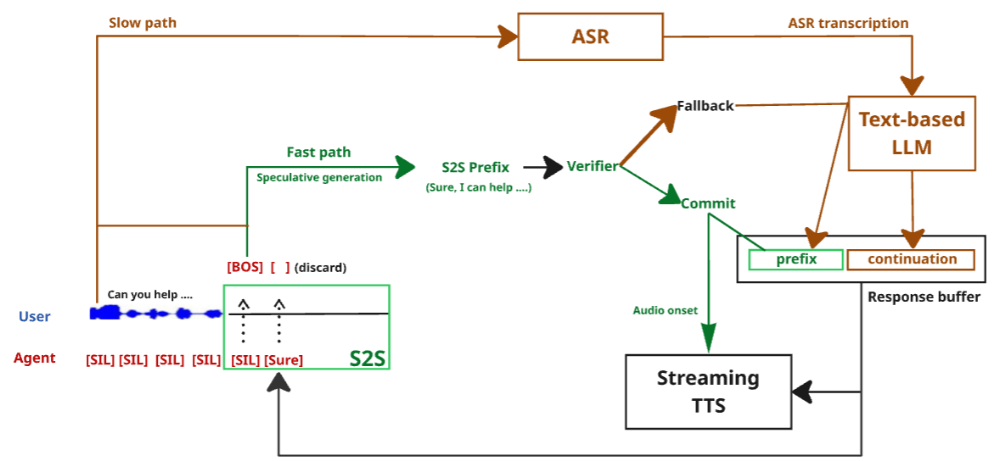

# RelayS2S — Slow Path, Prefix Verifier & Evaluation

This repository contains the **slow-path pipeline, prefix verifier, and end-to-end evaluation** code for [RelayS2S: A Dual-Path Speculative Generation for Real-Time Dialogue](https://arxiv.org/abs/XXXX.XXXXX). It sits alongside the [fast-path S2S model](../zip_s2s/) and covers everything needed to reproduce the paper's quality/latency results.

## Architecture Overview



## Installation

```bash
pip install -r requirements.txt
```

For local LLM inference you will also need the model weights (e.g. `Qwen/Qwen2.5-7B-Instruct`). For API-based backends, set the appropriate environment variables (`OPENAI_API_KEY`, `GEMINI_API_KEY`, etc.).

## Dataset & Pretrained Checkpoints

Download data and checkpoints from Hugging Face:

> **https://huggingface.co/datasets/mailong225/speech_to_speech/tree/main/relays2s**

Arrange your files as follows:

```
data/
├── asr_map.json                  # Pre-computed ASR transcriptions + latency per conversation
├── s2s_gen_test.jsonl            # Fast-path S2S generations (full responses + timing)
├── llm_fine_tuning_data.jsonl    # Multi-turn conversations for Qwen fine-tuning
└── verifier/
    ├── train.jsonl               # Verifier training split (with is_sensible labels)
    ├── valid.jsonl               # Verifier validation split
    ├── test.jsonl                # Verifier test split
    └── features/                 # Per-sample .pt files (hidden states + logit features)

checkpoints/
├── tokenizer/                    # S2S tokenizer (Qwen2.5-0.5B + special tokens)
├── qwen_05_tuned/                # Fine-tuned Qwen2.5-0.5B-Instruct weights
└── verifier/
    ├── best_model.pt             # Trained prefix verifier checkpoint
```

## Data Formats

### `s2s_gen_test.jsonl` — S2S generations

Each line is a JSON object representing one fast-path generated response:

| Field | Description |
|-------|-------------|
| `id` | Unique sample identifier |
| `conv_id` | Conversation identifier (links to `asr_map.json`) |
| `context` | List of dialogue turns (alternating user/assistant) |
| `response` | Full S2S-generated response text |
| `feature_path` | Filename of the `.pt` feature file (in `data/verifier/features/`) |
| `time_to_words` | List of floats — wallclock time (seconds) when each word was decoded |

### `data/verifier/{train,valid,test}.jsonl` — Verifier data

Same fields as above, plus:

| Field | Description |
|-------|-------------|
| `is_sensible` | Boolean — whether the first 5 words of the response form a sensible prefix |

### `asr_map.json` — ASR transcriptions

A JSON dict mapping `conv_id` → list of alternating user/assistant turns. Each turn has:

| Field | Description |
|-------|-------------|
| `text` | ASR-transcribed text (user turns) or original assistant text |
| `latency` | ASR processing time in seconds (user turns) or `null` (assistant turns) |

### `llm_fine_tuning_data.jsonl` — LLM fine-tuning data

Each line is a JSON array of conversation turns, each with `role` (`"user"` or `"assistant"`) and `text`.

## ASR Transcription

To regenerate the ASR map from raw audio (optional — a pre-computed `asr_map.json` is provided):

```bash
python asr.py \
    --input_jsonl path/to/test.jsonl \
    --audio_dir path/to/syn_dialogs/ \
    --model_name medium.en \
    --save_path data/asr_map.json
```

This uses Faster-Whisper (`medium.en`) via CTranslate2 and reports WER and average per-turn latency.

## LLM Fine-Tuning (Optional)

Fine-tune Qwen2.5-0.5B-Instruct as a local slow-path LLM:

```bash
python finetune_qwen.py \
    --model_name Qwen/Qwen2.5-0.5B-Instruct \
    --data_path data/llm_fine_tuning_data.jsonl \
    --output_dir checkpoints/qwen_05_tuned \
    --num_train_epochs 2 \
    --per_device_train_batch_size 4 \
    --gradient_accumulation_steps 4 \
    --learning_rate 2e-5
```

A pre-tuned checkpoint is provided in `checkpoints/qwen_05_tuned/`.

## Prefix Verifier

### Training

```bash
python -m prefix_verifier.train \
    --train_jsonl data/verifier/train.jsonl \
    --val_jsonl   data/verifier/valid.jsonl \
    --test_jsonl  data/verifier/test.jsonl \
    --feature_dir data/verifier/features \
    --tokenizer   checkpoints/tokenizer \
    --save_dir    checkpoints/verifier
```

The verifier is a lightweight model (~170K parameters) that takes per-token hidden states and calibration signals (entropy, log-probability, top-two margin) from the fast-path S2S decoder and predicts whether a prefix is safe to commit.

## Response Quality & Latency Evaluation

`run_eval.py` supports three modes controlled by the arguments:

### S2S Only

Evaluate the fast-path model's responses directly (no cascaded LLM):

```bash
python run_eval.py \
    --path_to_prediction data/s2s_gen_test.jsonl
```

### Cascaded Only

Replace all S2S responses with cascaded ASR → LLM output:

```bash
# Local model
python run_eval.py \
    --path_to_prediction data/s2s_gen_test.jsonl \
    --cascaded_llm "Qwen/Qwen2.5-7B-Instruct" \
    --cascaded_llm_backend local \
    --cascaded_replace_from_idx 0 \
    --asr_map_path data/asr_map.json

# API model (via litellm — supports OpenAI, Gemini, etc.)
python run_eval.py \
    --path_to_prediction data/s2s_gen_test.jsonl \
    --cascaded_llm "openai/gpt-4o" \
    --cascaded_llm_backend litellm \
    --cascaded_replace_from_idx 0 \
    --asr_map_path data/asr_map.json
```

### RelayS2S

Commit the first 5 words from the fast path (if the verifier approves), then continue with a cascaded LLM:

```bash
python run_eval.py \
    --path_to_prediction data/s2s_gen_test.jsonl \
    --cascaded_llm "Qwen/Qwen2.5-7B-Instruct" \
    --cascaded_llm_backend local \
    --cascaded_replace_from_idx 5 \
    --asr_map_path data/asr_map.json \
    --num_prefix_words 5 \
    --verifier_checkpoint checkpoints/verifier/best_model.pt \
    --verifier_threshold 0.5 \
    --verifier_tokenizer checkpoints/tokenizer \
    --verifier_feature_dir data/verifier/features
```

All modes report: average quality score (1–5), low-quality rate (% scored ≤ 3), average latency, and P90 latency. The RelayS2S mode additionally reports verifier keep/discard statistics.

Save detailed per-sample results with `--output_path results.json`.

## Live Interactive Demo

Coming soon!

## Project Structure

```
.
├── run_eval.py                   # Main evaluation script (S2S / Cascaded / RelayS2S)
├── asr.py                        # ASR transcription with Faster-Whisper
├── finetune_qwen.py              # Qwen2.5-0.5B full fine-tuning
├── utils.py                      # LLM loading, generation, quality evaluation, timing
├── llm_utils.py                  # litellm/OpenAI/Gemini wrappers, batch APIs, prompts
├── prompts.yaml                  # Evaluation prompt templates (quality scoring, prefix check)
├── requirements.txt              # Python dependencies
├── prefix_verifier/
│   ├── models.py                 # PrefixVerifier model, FocalLoss, PrefixGate inference
│   ├── dataset.py                # Dataset loading with parallel .pt feature reading
│   └── train.py                  # Training, evaluation, threshold tuning
├── data/                         # (download from HuggingFace)
└── checkpoints/                  # (download from HuggingFace)
```